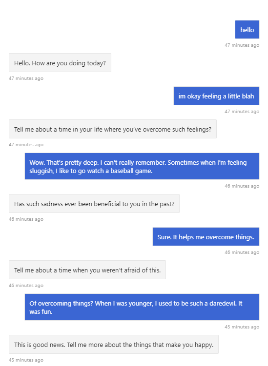

# Carl Rogers Chatbot

Example chatbot using the Microsoft Bot Framework, IBM Watson's NLU, and the Bot Builder Community's Watson NLU middleware for emotion detection to mimic a Rogerian therapist.

The intention with this chatbot is to show a tight loop of dialogs that repeat with different text prompts to encourage dialog based on the emotional output of the user. The bot's responses are limited to three randomized strings based on emotion and score differential. It's limited, but shows potential usage.

This bot uses the `EmotionDetection` middleware exclusively, which only lets you know the emotional context of the user's message. You would ideally use this in combination with entity extraction so your bot can better understand the content of the message, and respond appropriately.

> Again, this bot is very limited, and will repeat responses or seem off-topic depending on the user's message. It only analyzes the emotions of the message. Emotion detection is not meant to be used on its own, but instead in combination with entity extraction, sentiment analysis, categorization, etc.

## Installation

    git clone https://github.com/szul/chatbot-rogers
    cd chatbot-rogers
    npm install

## Services

You'll need an IBM Cloud account. You'll then need to create an NLU service. Once created, copy your API key and your endpoint, and place them in a `.env` file in the root of the chatbot application. It's contents should be:

    WATSON_API_KEY=<YOUR_KEY_GOES_HERE>
    WATSON_ENDPOINT=<THE_WATSON_NLU_ENDPOINT_GOES_HERE>

## Running

Navigate to the root of the chatbot application in a command prompt and type:

    node server.js

You can then use the Bot Framework Emulator to open the URL and interact with the bot.

